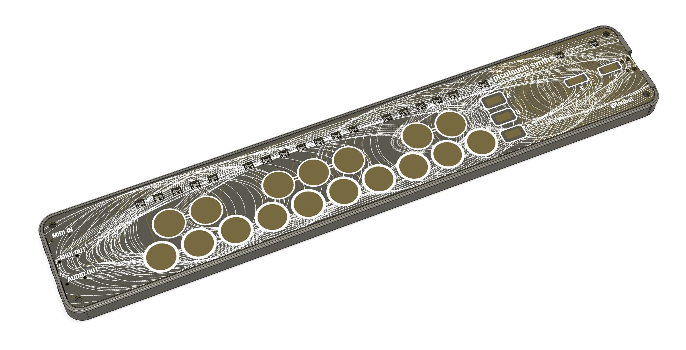
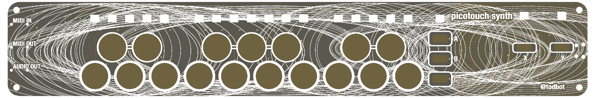
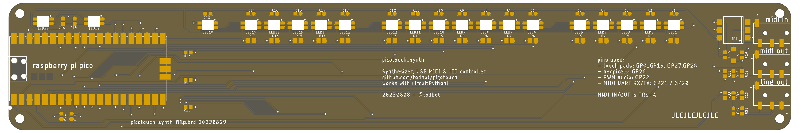
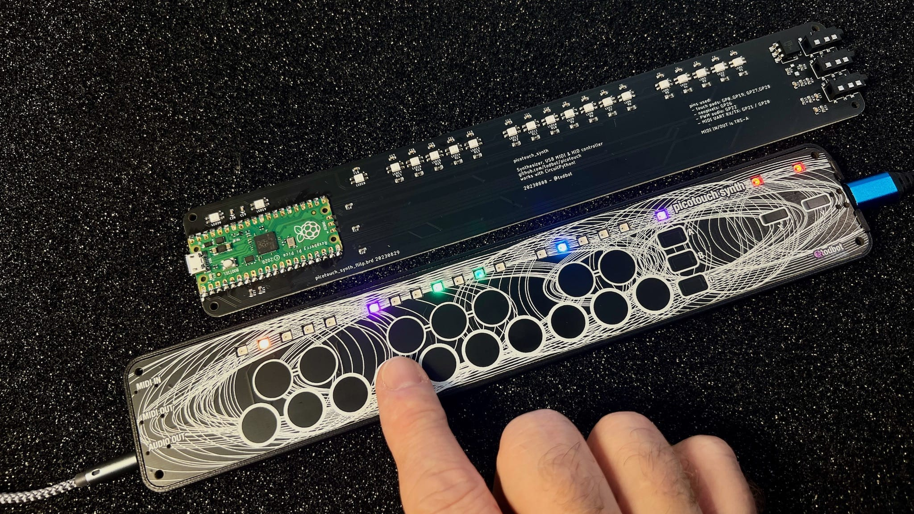
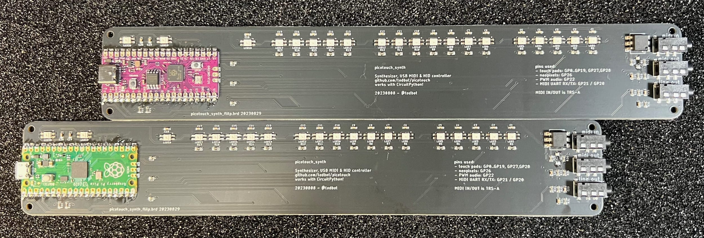
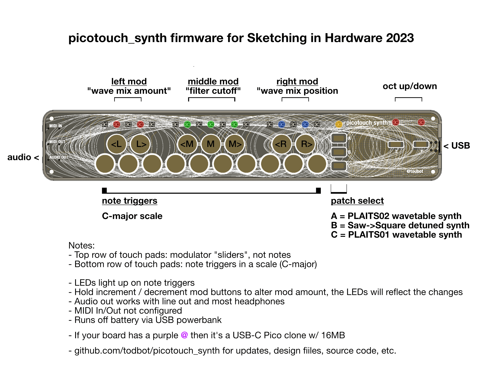

# picotouch_synth

Thin captouch-based synth platform for Raspberry Pi Pico

Features:
* Raspberry Pi Pico
* PWM Audio out
* TRS-A MIDI In / Out
* USB MIDI In/Out
* 19 RGB LEDs
* 22 touch pads (17 notes, 5 modifiers)
* Low part count: [14 BOM line items, mostly passives](./schematics/picotouch_synth_flip_bottom_bom.csv)
* Completely flat surface (only reverse-mount LEDs, capsense pads)
* 6 mm thick when in [minimal enclosure](https://github.com/todbot/picotouch_synth/tree/main/enclosure)
   (255 x 42 x 6 mm volume)

## Installing firmware

There are currently three "applications" for the picotouch_synth board:

- [picotouch_synth](./circuitpython/picotouch_synth) -- a wavetable synth with three different patches
- [pts_drum_machine](./circuitpython/pts_drum_machine) -- a drum sample player (in progress)
- [hwtest](./circuitpython/hwtest/) -- simple hardware test of the board

### Prebuilt UF2 images

If you want to install pre-built firmware for picotouch_synth,
go to the [Releases](https://github.com/todbot/picotouch_synth/releases) page
and download the UF2 you want.  Then, to install:

* Unplug picotouch_synth PCB board from USB
* Unclip PCB from case ([see this video on releasing the case](https://youtu.be/MjScFP873SQ))
* Hold BOOT button on Pico while plugging back into USB
* Copy the UF2 file to the RPI-RP2 drive
* When board finishes reflashing, it will reboot

__Note:__ if your Pico has more than the 2 MB standard flash
(like the [purple "RetroScaler" 16MB USB-C ones](https://www.aliexpress.us/item/3256804731684211.html)),
the UF2s will still work but the resulting CIRCUITPY drive only be 1 MB.
To get the flash space back, you will need to
[install CircuitPython](https://learn.adafruit.com/welcome-to-circuitpython/installing-circuitpython#for-rp2040-boards-3105171)
and install the code files by hand.

## Sketching in Hardware 2023 Edition

For the Sketching in Hardware conference, the firmware shipped on the boards is in
[circuitpython/picotouch_synth](https://github.com/todbot/picotouch_synth/tree/main/circuitpython/picotouch_synth)
and the pre-built UF2 firwmare in the [Releases section](https://github.com/todbot/picotouch_synth/releases/tag/v1).

There were two different boards handed out:
- [micro-USB green Raspberry Pi Picos w/ 2 MB flash](https://www.raspberrypi.com/documentation/microcontrollers/raspberry-pi-pico.html)
- [USB-C purple "RetroScaler" Pico clones w/ 16 MB flash](https://www.aliexpress.us/item/3256804731684211.html).

Both are formated as 2MB devices so if you have a purple board and want the extra flash space,
you'll need to
[install CircuitPython](https://learn.adafruit.com/welcome-to-circuitpython/installing-circuitpython#for-rp2040-boards-3105171)
and the code files by hand.

### The picotouch_synth application

The keyboard is laid out as top row is modulators (three groups of "sliders")
and the bottom row plays notes in a particular scale.
The A/B/C buttons select different sounds and the X/Y buttons on the right transpose up/down octaves.

